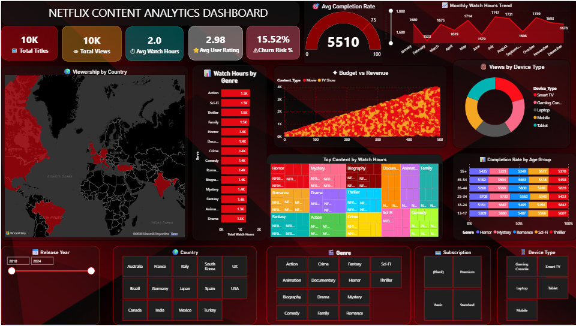

# 🎬 Netflix Content Analytics Dashboard

## 📌 Project Overview
This project is an interactive Netflix Analytics Dashboard designed to analyze streaming trends, content performance, and user engagement using modern data visualization techniques.

---

## 📊 Dashboard Features

### KPI Cards
- Total Titles
- Total Views
- Average Watch Hours
- Average User Rating
- Churn Risk

### Visualizations
- Global Viewership Map
- Watch Hours by Genre
- Monthly Watch Trends
- Budget vs Revenue Analysis
- Device Type Distribution
- Completion Rate by Age Group
- Genre Analysis

### Interactive Filters
- Release Year
- Country
- Genre
- Subscription Type
- Device Type

---

## 🛠 Tools Used
- Power BI
- Data Visualization
- Business Intelligence
- Analytics

---

## 🎯 Key Insights
- Drama and Sci-Fi genres have strong engagement
- Smart TV dominates device usage
- Monthly watch trends show seasonal peaks
- Different age groups have varying completion rates

---

## 📷 Dashboard Preview

---

## 🚀 Objectives
- Analyze Netflix streaming behavior
- Build interactive dashboards
- Generate business insights
- Improve UI/UX dashboard design skills

---

## 👩‍💻 Author
Archana S
